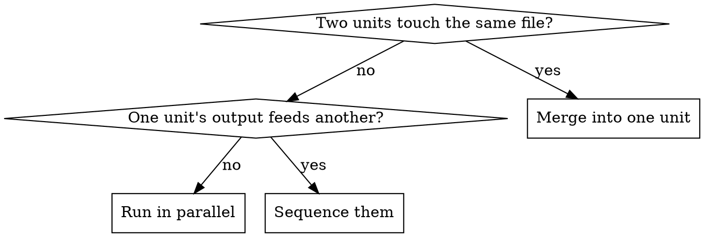

# Gauntlet loop

Source: https://somethingbig.ai/gauntlet-loop

A lead agent decomposes a goal into the smallest independently improvable units. Each unit gets a
**builder** and a **separate critic with fresh context**. The critic compares the work against a
concrete bar, names the single biggest remaining gap, and sends it back. Repeat.

The point is not the loop. The point is that an unreachable external bar plus a context-isolated
critic removes the agent's ability to declare itself finished.

## The bar is the whole technique

Without an inspectable bar this degrades into a builder talking to itself. "Make it good" is not a
bar. A bar is something a critic can open, run, or measure.

| Kind of work | A bar that works |
|---|---|
| Anything visual | The reference image on disk, screenshotted side by side with a render of ours |
| Behaviour | A command whose output must match: an existing runner, a golden file, a parity test |
| Code and prose style | A named existing file that is already excellent, compared paragraph by paragraph |
| Every round, always | The project's own build, lint, typecheck and test commands, quoted in the report |

The bar may be unreachable. That is the point: it prevents settling at "pretty good for a machine".

## Rules that decide whether it works

**The builder never grades itself.** It can justify its own choices too well.

**The critic inspects the artifact, never the builder's report.** State this explicitly in the
critic prompt, and give it the paths. A critic that reads a summary is grading prose.

**The critic runs on a different model from the builder** where the harness allows it. Same model
means correlated blind spots.

**Green gates are non-negotiable and re-run by the critic.** Builders report green on red more
often than you expect. The critic pasting real output is the check.

**Mutation is how a critic proves a test exists.** Instruct it to delete the behaviour and confirm
something goes red, then restore. In practice this catches the most: tests that exercise code
without pinning it, and parity tests shaped so they cannot fail.

**Say what "done" costs.** Unbounded rounds burn budget silently. Either bound the rounds or bound
the tokens, and say in the report which findings were left open when it stopped.

## Decomposition is where runs go wrong

Give every unit an explicit file list and an explicit "do not touch" list. Parallel builders with
overlapping files produce work that passes review and then loses half of itself.

## Quick reference

| Phase | What the prompt must carry |
|---|---|
| Build | The goal, the unit's files, the bar's location, the gate commands, house rules |
| Critique | The artifact's paths, the bar, "inspect it yourself", the gates, a structured verdict |
| Rework | Only the critic's named gap and evidence. Never "improve it generally" |
| Verify | Re-run the mutation that exposed the gap. If it stays green, it was not fixed |

Have the critic return a structured verdict rather than prose: gates green, material gap yes or no,
the single biggest gap, the evidence, and what to change. Prose verdicts are unactionable and
cannot be branched on.

A runnable orchestration skeleton is in `workflow-template.js` in this directory.

## Common mistakes

| Mistake | What happens |
|---|---|
| No bar on disk, only a description | The critic invents a standard and passes everything |
| Critic reads the builder's report | It grades the writing, not the work |
| Units share files | Parallel builders overwrite each other |
| One round | The first critique finds the shallow gaps; the second finds the real one |
| Trusting "all gates green" | Builders say it while a suite is red. Make the critic paste the output |
| Skipping the run when infrastructure fails | Resume from cache instead. Completed units should not be rebuilt |

## What it costs

Real numbers from a three-wave run on a TypeScript codebase: eight agents and roughly 990k
subagent tokens for one wave of two units at two critique rounds each. Budget accordingly, and tell
the person paying before starting, not after.
